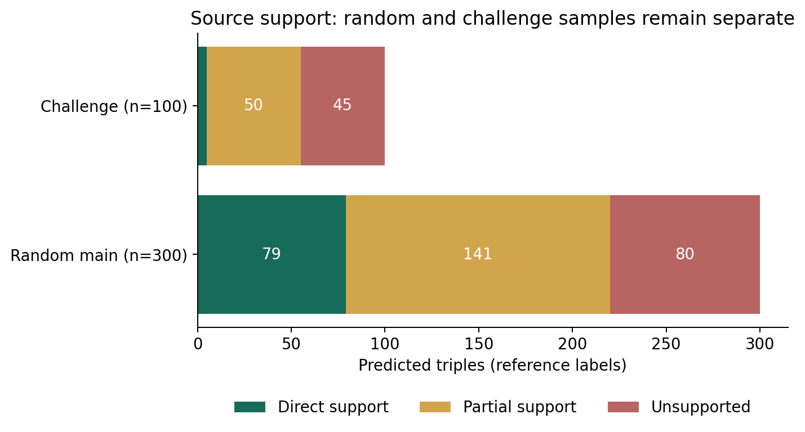
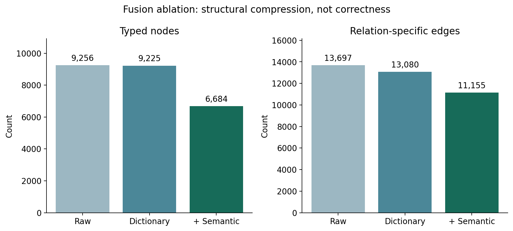
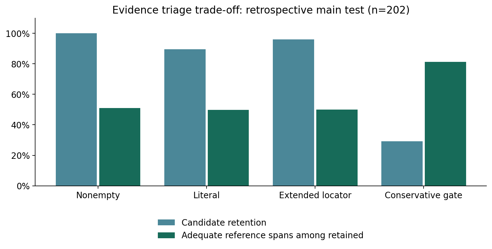

# Results and Discussion — SMA evidence-backed knowledge graph

Generated for the final-year dissertation on 2026-10-02. This is an evidence-based
chapter draft, not a completed university submission or independently validated
clinical resource. Run: `fyp_evaluation_2026-10-02`.

## 1. Evaluation scope and provenance

The source workbook identifies ChatGPT-GPT-5.6-Sol as the reviewer and describes iterative AI-assisted review. Actual human confirmation scope has not been established. No independent second-review labels were supplied. All quality numbers below are statistics against the supplied reference labels; independence and specialist medical expertise are not assumed.

The study addresses three questions: source support of extraction predictions
(RQ1), the structural and semantic effects of normalization (RQ2), and source
traceability with conservative evidence triage (RQ3). These questions do not
require training a new language model. The personal implementation contribution
in this evaluation is a provenance-checked review adapter, controlled aggregation
experiments, an offset-preserving locator and triage module, a reproducible
evaluation runner, and an offline source/review explorer. PubMed, Open Targets,
the extraction LLM, embedding model and established software libraries remain
external components and must be acknowledged in the final methods chapter.

Inputs comprised 4,554 stored PubMed title/abstract records and 18,288 canonical
extraction predictions. The supplied evaluation workbook contains a random main
sample of 300 predictions and a challenge sample of 100. Protected identifiers,
texts, entities, types, relations and spans exactly matched the frozen candidate
manifest. Chinese evidence labels were normalized as a representation change;
blank entity/relation/direction subchecks were not assigned inferred values.

## 2. Extraction source support (RQ1)

| Sample | n | Direct (2) | Partial (1) | Unsupported (0) | Strict | Lenient | Adequate spans |
| --- | --- | --- | --- | --- | --- | --- | --- |
| Random main | 300 | 79 | 141 | 80 | 26.3% | 73.3% | 151 |
| Challenge | 100 | 5 | 50 | 45 | 5.0% | 55.0% | 39 |

The random sample strict support was 26.3%, with
an approximate Wilson 95% interval of 21.7%–31.6%. A source-
cluster bootstrap, retaining all sampled predictions within each resampled PMID,
gave 21.3%–31.1% (2,000 replicates; seed 20261002).
The 300 predictions originated from 290 PMIDs. These
intervals describe sampling variation conditional on the reference labels; they
do not quantify reviewer bias or establish clinical correctness.

The difference between strict and lenient support is material. Partial support
includes statements requiring inference or losing conditions and should not be
advertised as fully correct graph facts. The challenge sample is deliberately
nonrepresentative and was not pooled into the population estimate. No unknown
support labels were present, which is a property of this reference dataset,
not proof that every biomedical case is unambiguous.

Review notes identify condition/strength generalization, entity-type errors and
incomplete spans as recurring issues. The workbook's error categories can overlap
and are not an exhaustive independent component assessment. Separate entity-type
or direction accuracies are unavailable because their columns were left blank.
High pipeline confidence scores are heuristic and are not measured accuracy.
The present prediction-based sample cannot measure missing relations; therefore
extraction recall and extraction F1 are not reported.

## 3. Controlled fusion comparison (RQ2)

| Condition | Input records | Typed nodes | Unique relation edges | Weak components | Potential conflicts | Self-loop edges |
| --- | --- | --- | --- | --- | --- | --- |
| raw | 18288 | 9256 | 13697 | 334 | 32 | 0 |
| dictionary | 18288 | 9225 | 13080 | 333 | 35 | 2 |
| semantic | 18288 | 6684 | 11155 | 171 | 59 | 13 |

All conditions used the same 18,288 extraction records and the same aggregation
implementation. Dictionary mapping was replayed against the current resource;
there were zero mapping replay or stable-field discrepancies. The semantic
condition used the saved PubMedBERT-embedding alignment output at the recorded
threshold of 0.88. This experiment isolates that output's effect; it does not
retrain the embedding model or select a new similarity threshold.

Relative to 13,697 unique raw relation signatures, dictionary normalization
reduced edges by 4.5%;
adding semantic alignment reduced them by 18.6%.
All source record counts and PMID groups were preserved. Re-aggregation of the
semantic input reproduced the canonical fused output byte for byte. Connectivity
changed, with fewer weak components and a smaller proportion outside the largest
component. These are engineering results, not evidence of biomedical identity.

Potential conflict pairs increased from 32 to 59 and self-loop relation signatures
from 0 to 13. Possible explanations include bringing genuinely related evidence
together, over-merging distinct entities, or differences in study conditions.
The experiment does not discriminate these explanations without semantic review.
Thirty uniformly sampled changed-mapping units were prepared (seed 20261002),
with original source contexts and separate dictionary/semantic judgments. Their
labels have not been supplied, so mapping accuracy remains unavailable.

A traceability example demonstrates why this distinction matters: the saved
fusion edge Nusinersen → SMN1 (TARGETS) contains a prediction whose original
second entity is SMN2 (raw record 1734; PMID 41028674). The source span names
SMN2. This is an observed change of entity identity that requires mapping review,
not a newly adjudicated error label. Original-prediction support must not be
transferred automatically to the differently named fused edge.

Node accounting uses name plus type and relation accounting preserves relation
identity. The existing Neo4j importer instead merges `Entity` nodes by name.
The literature snapshot has 6684 typed nodes
and 6524 name-only nodes; there are
155 names assigned multiple types.
Consequently these offline literature counts should not be substituted for the
historical Neo4j counts including Open Targets. This also identifies an identity
model limitation to address before claiming type-separated database semantics.

## 4. Evidence traceability and triage (RQ3)

The previous scoring component only tested evidence nonemptiness. The new module
retains source character offsets through typography/whitespace normalization,
locates ordered ellipsis fragments within a single source field, and suggests
nearby sentences for unmatched spans. Fuzzy suggestions are never automatically
accepted. A conservative eligibility gate requires traceability, lexical coverage
of both endpoints, sufficient span length and a predicate cue. Negation,
uncertainty, experimental context and ellipsis gaps trigger review. Controlled
dictionary aliases and source-defined acronyms can supply lexical endpoint forms;
embedding similarity is not used as evidence of identity.

Whole-corpus locations: {'not_located': 1152, 'exact': 15733, 'ordered_fragments': 1265, 'normalized': 138}. Exact matching
located 15,733 records. The improved locator additionally recovered normalized
spans and 1,265 ordered-fragment spans, leaving 1,152 unlocated. Recovery of a
fragment establishes where its words came from, not whether omitted text changes
the conclusion. Original evidence is never replaced by a suggested sentence.

The internal development/test assignment is deterministic and PMID-disjoint,
including across the main/challenge groups. The four examples inspected during
onboarding were assigned to development. Rules were not optimized against test
labels; however, the workbook already existed and had undergone multiple reviews.
Results are therefore a retrospective internal evaluation, not a prospective
external benchmark. The main test subset contains 202 predictions.

| Gate | Retained / n | Span PPV | Adequate-span sensitivity | Specificity | Strict relation support among retained |
| --- | --- | --- | --- | --- | --- |
| nonempty | 202 / 202 | 51.0% | 100.0% | 0.0% | 27.2% |
| literal | 181 / 202 | 49.7% | 87.4% | 8.1% | 26.5% |
| traceable | 194 / 202 | 50.0% | 94.2% | 2.0% | 26.3% |
| triage_gate | 59 / 202 | 81.4% | 46.6% | 88.9% | 40.7% |

The conservative gate increased adequate-reference-span PPV from
51.0% to
81.4%, while retaining only
29.2% of candidates. It retained 48 adequate
spans and 11 inadequate spans, and routed 55 reference-
adequate spans for review. This shows enrichment at a substantial coverage cost.
Source-supported relations retained numbered 24
out of 55. Evidence quality and relation
factuality must remain separate: strict relationship support among retained
predictions was only 40.7% against
the reference labels. The 81.4%
figure cannot be presented as knowledge-graph accuracy.

The appropriate product behavior is review prioritization and transparent source
display, preserving every original record. The gate should not silently delete
flagged facts or promote eligible spans to verified facts. Negation/context
heuristics are deliberately conservative and may route valid statements to review.
No semantic entailment model was implemented in this scope.

## 5. Case analysis and inspection

The offline explorer provides keyword, PMID, sample-group, reference-support and
triage filters; each candidate opens its complete saved abstract, original span,
source highlights, review reasons and PubMed link. Mapping review records can be
entered and exported without altering the supplied workbook. Empty searches have
an explicit state. Labels shown in the browser remain reference labels until
their human provenance is established.

The companion `graph_explorer.html` exposes the complete frozen literature
graph, a bounded directed neighbourhood, entity and relation filters, potential
conflict states and every joined original evidence record. A multi-source edge
shows distinct PMIDs separately from record count, preserving repeated
predictions without calling them independent papers. Open Targets associations
carry Ensembl/disease identifiers and their source score; they are displayed in
a separate identifier namespace and do not acquire invented PubMed evidence.
This is an offline snapshot view, not a live Neo4j database measurement.

For example, SMA-RE-0001 illustrates a supported relationship with an incomplete
span in the supplied review: the fragment contains only the outcome phrase.
SMA-RE-0002 illustrates ordered fragments and the need to distinguish a gene
from the conditions under which variants are related to a phenotype. These are
reference-review examples, not new medical findings. Detailed row-level results
and original reviewer reasoning remain in the run package for inspection.

## 6. Comparison with relevant literature

BioRED provides a curated biomedical relation dataset and annotation guidelines,
illustrating the value of independently specified entity and relation annotation
[1]. Its benchmark scores cannot be directly compared with this project's
prediction-only SMA support rate because the tasks and denominators differ.
The present audit addresses source support; exhaustive document annotation would
be needed for a comparable recall evaluation.

The embedding provider describes its model as a sentence-similarity model built
from PubMedBERT and trained on medical title/abstract pairs [2]. This supports
the domain-representation choice, but does not validate a cosine threshold as an
entity-identity decision. SapBERT specifically addresses biomedical entity
representations through synonym-based self-alignment [3], motivating an
entity-linking alternative to evaluate later rather than assuming that sentence
similarity alone is sufficient.

## 7. Limitations and conclusions against objectives

RQ1: the supplied integrated labels have been validated and summarized; actual
human verification scope remains unconfirmed.
Independent inter-annotator agreement and exhaustive-relation recall remain
unavailable. RQ2: controlled structural effects and provenance preservation are
demonstrated, while biomedical mapping correctness awaits the 30-unit review.
RQ3: source-offset traceability and conservative triage are implemented, tested
and retrospectively evaluated; semantic entailment remains outside this module.

The results support the feasibility of an auditable construction and inspection
workflow. They also reveal that nonempty spans, high confidence and a smaller
graph are insufficient evidence of reliable biomedical statements. The next
quality improvement should address conditions, typing and entity identity,
following actual error categories rather than adding model complexity alone.
GraphRAG, answer citation validation and claim-level support validation remain
future work and are not described as completed innovations. The tool is a
research prototype, not a clinical decision system or validated target-discovery
resource. The submitted dissertation should incorporate these measured outcomes
into its introduction/objectives, methods, project-plan review and conclusions,
and acknowledge permitted AI assistance under the applicable assessment brief.

## References and reproducibility

[1] Luo et al., BioRED: a rich biomedical relation extraction dataset (2022).
https://pmc.ncbi.nlm.nih.gov/articles/PMC9487702/

[2] NeuML, pubmedbert-base-embeddings model card (accessed 2026-10-02).
https://huggingface.co/NeuML/pubmedbert-base-embeddings

[3] Liu et al., Self-Alignment Pretraining for Biomedical Entity Representations,
NAACL 2021. https://aclanthology.org/2021.naacl-main.334/

[4] NIST/SEMATECH e-Handbook, binomial proportion confidence intervals.
https://www.itl.nist.gov/div898/handbook/prc/section2/prc241.htm

Local evidence: `manifest.csv`, `run_config.json`, `review_report.json`,
`fusion_comparison.json`, `evidence_comparison.json`,
`evidence_candidate_results.csv`, `database_identity_diagnostics.json`,
`validation_summary.json`. The manifest fixes input and algorithm hashes;
the presentation manifest fixes report/UI builder hashes. No workbook, canonical
data or database was changed by this evaluation.
