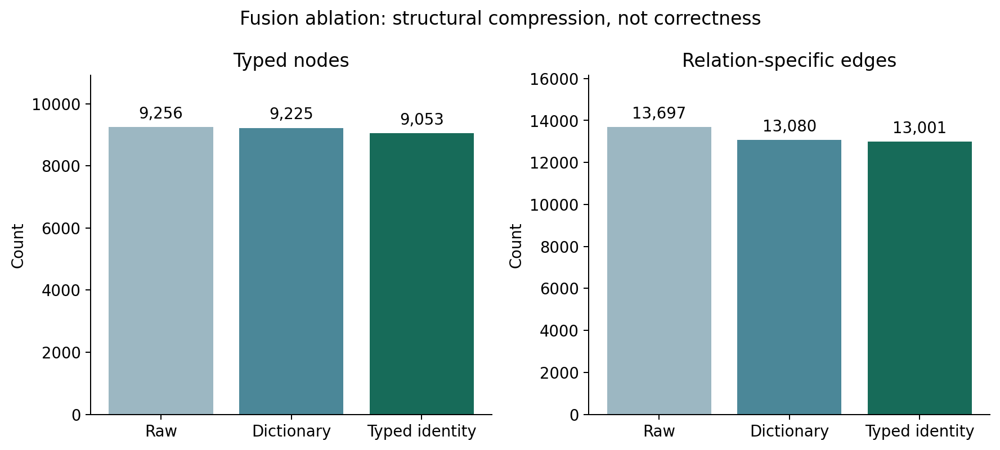

# Results and Discussion: identity repair and assertion screening

## Objectives and research questions

The core project constructs an auditable SMA knowledge graph from a fixed PubMed abstract corpus and Open Targets snapshot. RQ1 measures source support and recurring extraction errors. RQ2 compares raw, dictionary and conservative typed-identity fusion while preserving provenance. RQ3 tests whether evidence, context and type screening can enrich retained original predictions, and quantifies the associated coverage loss. GraphRAG answer generation and answer-level citation/claim validation are future work.

## Fixed data and human labels

The corpus contains 4,554 PubMed source records and 18,288 original predictions. The user confirmed all 400 supplied labels were human-assigned, with ChatGPT only assembling the workbook. Protected source fields match the frozen sample. The random main sample contains 300 predictions from 290 PMIDs; the 100 challenge predictions are reported separately. The original workbook is unchanged. No independent second-review agreement or exhaustive extraction recall is available.

Main strict support is 26.3% (79/300), partial support 47.0% (141/300), unsupported 26.7% (80/300). Lenient support 73.3% combines strict and partial judgments; it is not fully correct accuracy. Human error-category strings include 62 condition/strength cases, 79 partial-support plus evidence cases, and several overlapping typing categories. Empty component-label fields prevent separate type/direction accuracy claims. Heuristic confidence and model self-scores are not measured accuracy.

## Identity defect and repair

The previous semantic aligner grouped embeddings by type but used a name-only global map and global name frequencies. It also formed transitive similarity components, allowing different genes and clinical subtypes to collapse. SMN1 and SMN2 have distinct NCBI Gene identifiers (6606 and 6607). The fix uses (type, name) keys and frequencies throughout. Automatic identity normalization retains punctuation, numbers and qualifiers, using only case/spacing-equivalent typed names after dictionary mapping. Similarity can produce review proposals, never automatic identities. Dictionary mapping rejects conflicting authoritative IDs and subtype changes; ambiguous context-free aliases OA and exon 7 were removed (neither occurred in this frozen corpus).

All 982 previously observed SMN2-to-SMN1 endpoint transformations across 618 PMIDs were restored to SMN2. No automatic alignment changes failed the typed-orthographic policy check. All 18,288 original records, evidence texts and PMID associations are preserved. This verifies the demonstrated identity defects; it does not establish all dictionary mappings are medically correct.

| Condition | Typed nodes | Relation edges | Conflict pairs | Self loops |
| --- | --- | --- | --- | --- |
| Raw predictions | 9256 | 13697 | 32 | 0 |
| Dictionary | 9225 | 13080 | 35 | 2 |
| Historical semantic baseline (unsafe) | 6684 | 11155 | 59 | 13 |
| Repaired typed identity | 9053 | 13001 | 36 | 2 |

The repaired graph has 13,001 literature edges and 9,053 typed literature nodes. Its larger size is expected after removing unsafe merges. The historical baseline is displayed only as a preserved reference. The raw/dictionary/repaired conditions share extraction records and aggregation implementation; the unsafe baseline used the older dictionary. Compression and connectivity are structural measures, not synonym accuracy. A new fixed 30-unit review queue belongs to the repaired condition. Pending mapping judgments remain missing; old labels cannot be transferred to changed fused facts. Explicit promotion is recorded separately with rollback snapshots.

## Controlled extraction-quality improvement

The source-offset locator remains separate from assertion screening. The additional rule screen retains complete source sentences and detects explicit population/stage, experimental-model, comparator, perturbation and modality cues. Known-name/type contradictions and ambiguous gene-symbol context are routed for review. A revised future extraction prompt requires complete exact quotations and preservation of conditions, and prohibits generalizing gene perturbations to the bare gene. That prompt has not replaced or re-extracted the canonical corpus, so no accuracy gain is attributed to it.

The model screen receives only the original assertion and title/abstract, with no human support labels or reviewer notes. It checks typed endpoints, directed relation and preservation of conditions. A direct decision is eligible only when boolean schema checks pass, missing-conditions is empty and its supporting quotation is an exact complete source sentence. Failures and partial/unclear cases fail closed. The combined gate also requires the original evidence span to pass the prior traceability gate. Model quotes are separately labelled supporting quotations; original evidence is never replaced.

Rules, prompt, model, hashes and endpoint definitions were frozen before calls in frozen_protocol.json. This is a retrospective internal paired experiment on a previously inspected dataset, using the existing PMID-disjoint development/test assignment. It is not an unseen prospective benchmark. The model produced 400 decisions with 0 request failures and 108 quote/schema failures. Invalid model outputs were preserved and excluded from acceptance.

Random main internal test:

| Screen | Retained/n | Strict supported retained/total | Strict PPV | Strict false accepts | Strict positives routed to review | Original adequate-span PPV |
| --- | --- | --- | --- | --- | --- | --- |
| all_predictions | 202/202 | 55/55 | 27.2% | 147 | 0 | 51.0% |
| previous_evidence_triage | 59/202 | 24/55 | 40.7% | 35 | 31 | 81.4% |
| context_type_screen | 17/202 | 6/55 | 35.3% | 11 | 49 | 76.5% |
| model_direct_screen | 88/202 | 31/55 | 35.2% | 57 | 24 | 60.2% |
| combined_screen | 30/202 | 14/55 | 46.7% | 16 | 41 | 86.7% |

Challenge internal test (not pooled):

| Screen | Retained/n | Strict supported retained/total | Strict PPV | Strict false accepts | Strict positives routed to review | Original adequate-span PPV |
| --- | --- | --- | --- | --- | --- | --- |
| all_predictions | 62/62 | 1/1 | 1.6% | 61 | 0 | 33.9% |
| previous_evidence_triage | 3/62 | 0/1 | 0.0% | 3 | 1 | 33.3% |
| context_type_screen | 1/62 | 0/1 | 0.0% | 1 | 1 | 100.0% |
| model_direct_screen | 14/62 | 1/1 | 7.1% | 13 | 0 | 42.9% |
| combined_screen | 0/62 | 0/1 | not available | 0 | 1 | not available |

The combined gate retained 30 of 202 original test predictions. Strict support among retained candidates was 46.7%; it retained 14 of 55 strictly supported predictions. The other 41 strict positives were routed to review, not deleted. This is selective enrichment, not correction of all predictions or a new full-graph accuracy estimate.

The combined strict-support cluster-bootstrap 95% interval is 30.0-63.3%, overlapping the previous evidence gate's 28.8-52.5%. This does not establish a statistically reliable improvement. Concrete errors demonstrate the remaining mechanisms. SMA-RE-0013 (PMID 38165463) was retained although the human label is partial: the quoted sentence omits the study's children/type II-III scope elsewhere in the abstract. SMA-RE-0024 (PMID 32218991) was retained despite human label 0: a tp53 pathway was interpreted as the tp53 gene. Conversely, SMA-RE-0011 is human-strict but the lexical predicate detector misses 'heralded by'; SMA-RE-0031 is human-strict from the full abstract but its original fragment lacks the disease endpoint. Thus model screening can miss document-level restrictions and entity referents, while original-span screening rejects some semantically supported assertions. All 16 strict false accepts and 41 strict positives routed to review are preserved in screening_error_cases.jsonl. These examples explain failure without revising thresholds after evaluation.

During final UI acceptance, decimal punctuation was found to truncate sentence context. A documented implementation correction replayed the same 400 preserved model responses, with no new calls or label/prompt/threshold changes. The earlier run remains historical; replay_provenance.json records the correction. Sentence segmentation still uses a heuristic; abbreviation and reference resolution limitations remain.

Span adequacy concerns the original human-labelled evidence span, not the model's newly quoted supporting sentence. Strict support uses label 2 only. Selective precision must always be reported beside retention and strict-positive loss. These screens can prioritize review and expose conditions, but cannot supply new human labels, prove new assertions correct, or justify automatic deletion. Remaining false accepts and false rejects are available by candidate ID for case analysis; no thresholds were tuned after inspecting outcomes.

## Database acceptance and visualization

Database acceptance status: passed. The importer uses a separate SMAEntity label with versioned (namespace, type, exact-name/source-ID) identity. Literature and Open Targets relationships have distinct source keys, preserving their provenance and scores. Historical Entity nodes and constraints remain untouched. Counts refer to the versioned current graph, not the sum of historical and repaired databases. Online results and all acceptance queries are recorded in database_acceptance.json when available.

The offline graph joins every repaired literature edge back to all original records and complete title/abstract sources. Open Targets nodes retain source identifiers in a distinct namespace. Full sentence contexts and review flags are shown per record. The evidence explorer shows the unchanged 400 human labels, rule reasons and separately labelled model decisions. Neither UI presents eligible/model-screened candidates as human-verified facts.

## Limitations and scope

The repaired identity policy trades aggressive compression for conservative distinctions. Its regression tests verify known failures, not all biomedical mappings. The human sample estimates support of predictions, not recall of all facts in abstracts. Rules can flag legitimate conditional statements. The model can misjudge semantics even with an exact quote. Evidence from abstracts omits full-text details. Clinical reliability, causal validity and target novelty are not established. Independent mapping review and additional prospective human evaluation would strengthen the work but are not fabricated here.

The preliminary specification and plan should promise construction, traceability, controlled fusion and selective assertion screening; GraphRAG and generated-answer citation/claim validation belong to future work. Technical analysis should discuss the identity failure, precision/retention trade-off, component-label limits and database migration evidence. This chapter is material for the final dissertation, not the complete university submission.

## Reproducibility and sources

Input hashes: manifest.csv. Fusion/promotion: D:/kg_sma_0704/artifacts/runs/stage3_identity_repair_2026-10-02. Assertion screening: D:/kg_sma_0704/artifacts/runs/assertion_quality_context_fixed_2026-10-02, frozen_protocol.json, label_blind_requests.jsonl, model_decisions.jsonl, candidate_quality_results.jsonl and validation_summary.json. UI/figure hashes: presentation_manifest.json and graph_explorer_manifest.json. Historical experiment artifacts remain unchanged.

NCBI SMN1: https://www.ncbi.nlm.nih.gov/gene/6606/ ; SMN2: https://www.ncbi.nlm.nih.gov/gene/6607/ (checked 2026-10-02).
